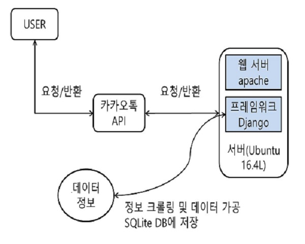

# HKNU_FOOD

### 2019년03월 27일 이후 더 이상 서비스 되지 않습니다.

# 한경대학교 학식알리미

카카오톡 플러스친구를 통해 한경대학교 **학식 정보, 실시간 열람실 정보, 한경대학교 버스정류장 정보, 전국 미세먼지 정보** 등을 간편하게 확인할 수 있는 챗봇서비스입니다.

# 사용 기술
- Language & Framework
  - Python
  - Django
- Database
  - SQLite
- Server
  - AWS ubunt 16.04
  - Apache
- Utility
  - Putty
  - FileZilla

# 개요

# 파일 별 핵심기능 및 역할
- myproject
  - hkuhaksik
    - businfo.py  - 공공 데이터 포털 API를 이용해 실시간 버스정보 처리 및 전달
    - miseinfo.py - 공공 데이터 포털 API를 이용해 실시간 미세먼지 정보 처리 및 전달
    - models.py   - SQLite 스키마 선언
    - urls.py     - DB 업데이트 및 스케줄링을 위한 함수 호출
    - views.py    - 실직적 데이터 처리 부분 (버튼, 학식 정보 처리)
